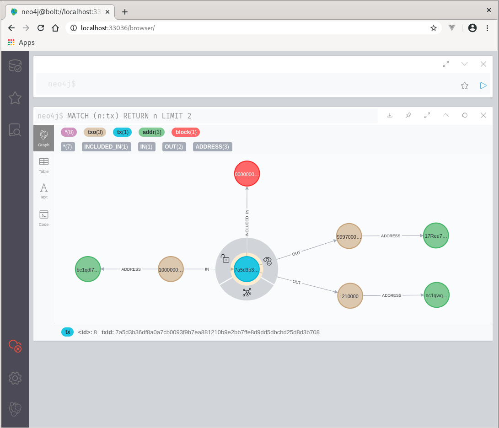

[](https://www.travis-ci.org/theborakompanioni/spring-boot-bitcoin-starter)
[](https://github.com/theborakompanioni/spring-boot-bitcoin-starter/blob/master/LICENSE)

spring-boot-bitcoin-starter
===

Spring boot starter projects with convenient dependency descriptors for multiple Bitcoin related modules that you can 
include in your application. Strong focus on [JSR354](https://github.com/JavaMoney/jsr354-api) and representing, 
transporting, and performing comprehensive calculations with Bitcoin in financial applications and monetary computations.

## Modules
### bitcoin-jsr354
Contains a JSR354 compliant `CurrentyUnit` implementation representing Bitcoin.

### spring-jsr354
A module containing a spring boot starter for convenient handling of JSR354 beans.
This module creates an application context aware JSR354 Service Provider (`javax.money.spi.ServiceProvider`)
that provides beans in the application context to be used by JSR354 factories (`javax.money.Monetary`).

### xchange-jsr354
A module containing a spring boot starter for integrating [XChange]( https://github.com/knowm/XChange)
in JSR354 currency conversions. Provides a
`javax.money.convert.ExchangeRateProvider` implementation that uses `org.knowm.xchange.Exchange` beans
to supply exchange rates from popular Bitcoin exchanges.

e.g.
```java
CurrencyConversion btcToUsdConversion = MonetaryConversions.getConversion(ConversionQueryBuilder.of()
    .setBaseCurrency(Monetary.getCurrency("BTC"))
    .setTermCurrency(Monetary.getCurrency("USD"))
    .build());

Money singleBitcoin = Money.of(BigDecimal.ONE, "BTC");
Money singleBitcoinInUsd = singleBitcoin.with(btcToUsdConversion);

log.info("{} equals {}", singleBitcoin, singleBitcoinInUsd);
// e.g. "BTC 1.00 equals USD 13806.90"
```

### bitcoin-zeromq-client
A module containing a spring boot starter for a Bitcoin Core ZeroMq API client.
The Starter will automatically create autowireable `ZeroMqMessagePublisherFactory` beans
for every zmq endpoint:

```yaml
org.tbk.bitcoin.zeromq:
  network: mainnet
  zmqpubrawblock: tcp://localhost:28332
  zmqpubrawtx: tcp://localhost:28333
  zmqpubhashblock: tcp://localhost:28334
  zmqpubhashtx: tcp://localhost:28335
```

Here is an example of how to subscribe to messages:
```java
@Slf4j
public final class SubscribeToBitcoinTransactionsViaZeroMqExample {

  @Autowire
  @Qualifier("bitcoinRawTxZeroMqMessagePublisherFactory")
  private MessagePublisherFactory<byte[]> rawTxMessageFactory;

  public void start() {
    this.rawTxMessageFactory.create().subscribe(rawTx -> {
      log.info("Got raw transaction: {}", rawTx);
    });
  }
}
```

See the autoconfig class `BitcoinZeroMqClientAutoConfiguration` for more details.

Also, if you have [Bitcoinj](https://github.com/bitcoinj/bitcoinj) in the classpath, it will create a bean
of type `BitcoinjTransactionPublisherFactory` and `BitcoinjBlockPublisherFactory` which will emit Bitcoinj types for your convenience.


### bitcoin-jsonrpc-client
A module containing a spring boot starter for a [ConsensusJ](https://github.com/ConsensusJ/consensusj) Bitcoin Core JSON-RPC API client.
The Starter will automatically create an autowireable `BitcoinClient` bean:

```yaml
org.tbk.bitcoin.jsonrpc.client:
  enabled: true
  network: mainnet
  rpchost: http://localhost
  rpcport: 8332
  rpcuser: myrpcuser
  rpcpassword: 'myrpcpassword'
```


### examples
There are also some example applications showing basic usage of the functionality provided by these modules.

#### bitcoin-exchange-rate-example-application
Start the application and open url `http://localhost:8080/api/v1/exchange/latest?base=BTC&target=USD&provider=KRAKEN`

Example output (2020-11-08):
```json
{
  "base" : "BTC",
  "rates" : [ {
    "base" : "BTC",
    "chain" : [ ],
    "derived" : false,
    "factor" : "15400.00000",
    "meta" : {
      "ask" : "15400.00000",
      "bid" : "15399.90000",
      "high" : "15450.00000",
      "javax.money.convert.RateType" : "DEFERRED",
      "last" : "15400.00000",
      "low" : "14365.00000",
      "open" : "14837.40000",
      "provider" : "KRAKEN",
      "providerDescription" : "Kraken is a Bitcoin exchange operated by Payward, Inc.",
      "providerName" : "Kraken",
      "quoteVolume" : "119845666.5998900000000",
      "rateTypes" : [ "DEFERRED" ],
      "volume" : "7782.18614285",
      "vwap" : "14916.50557"
    },
    "provider" : "KRAKEN",
    "target" : "USD",
    "type" : "DEFERRED"
  } ]
}
```

#### bitcoin-tx-stats-example-application
Start the application and open url `http://localhost:8080/api/v1/tx/score/0e3e2357e806b6cdb1f70b54c3a3a17b6714ee1f0e68bebb44a74b1efd512098`

#### bitcoin-neo4j-example-application
Start the application and open the neo4j browser.
The port is random on every start.



## Development
### Requirements
- java >=11
- docker

To run all examples you need access to a Bitcoin Core node.

Optional: To enable all features the node should publish `rawtx` and `rawblock` messages via zmq.
  
### Build
```
./gradlew clean build
```

# Resources
- Bitcoin: https://bitcoin.org/en/getting-started
- JSR354 (GitHub): https://github.com/JavaMoney/jsr354-api
- Spring Boot (GitHub): https://github.com/spring-projects/spring-boot
- XChange (GitHub): https://github.com/knowm/XChange
- ConsensusJ (GitHub): https://github.com/ConsensusJ/consensusj
- JermoMq (GitHub): https://github.com/zeromq/jeromq
- Bitcoinj (GitHub): https://github.com/bitcoinj/bitcoinj
- Project Reactor (GitHub): https://github.com/reactor/reactor-core
- Neo4j (GitHub): https://github.com/neo4j/neo4j

# License
The project is licensed under the Apache License. See [LICENSE](LICENSE) for details.
